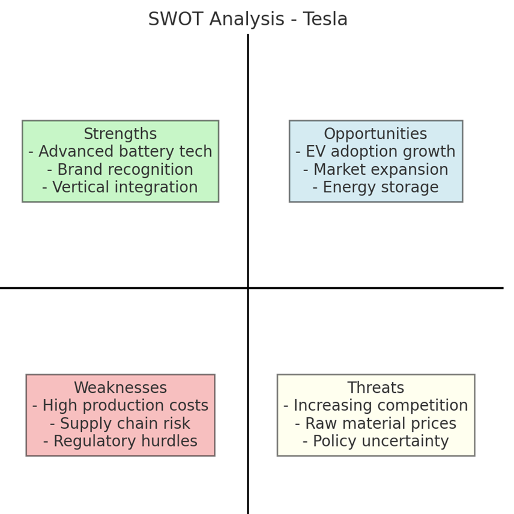
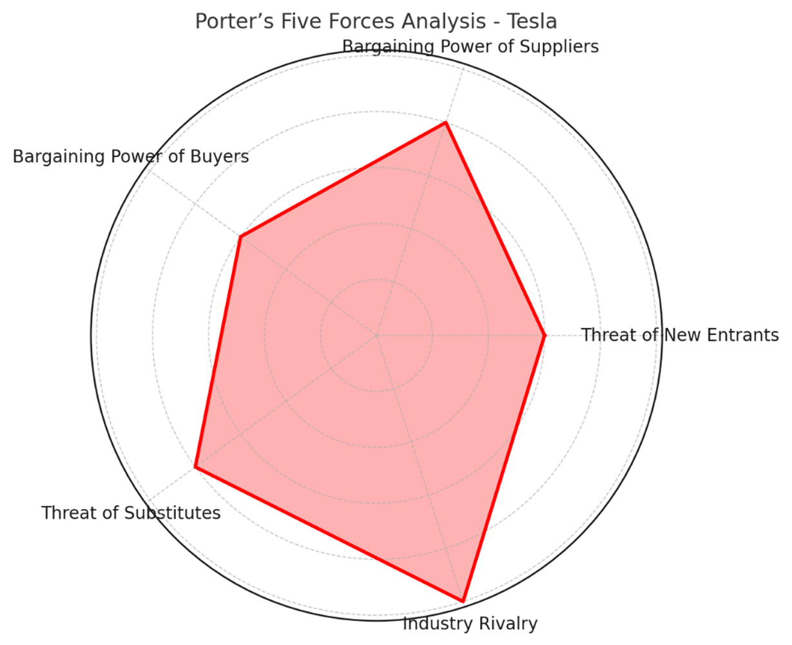
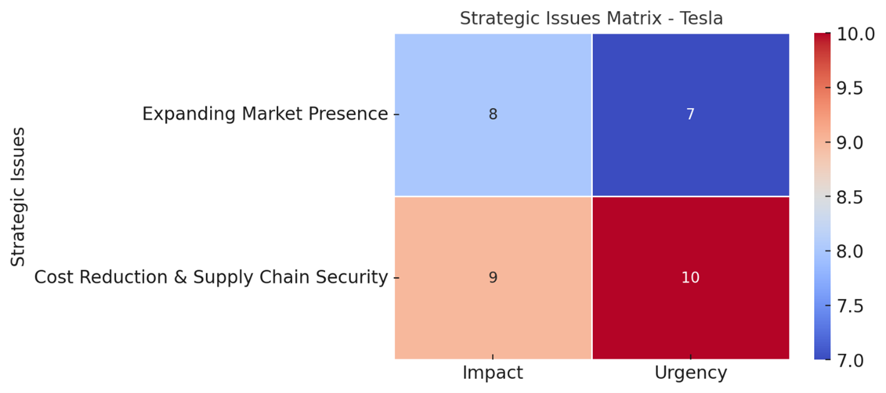
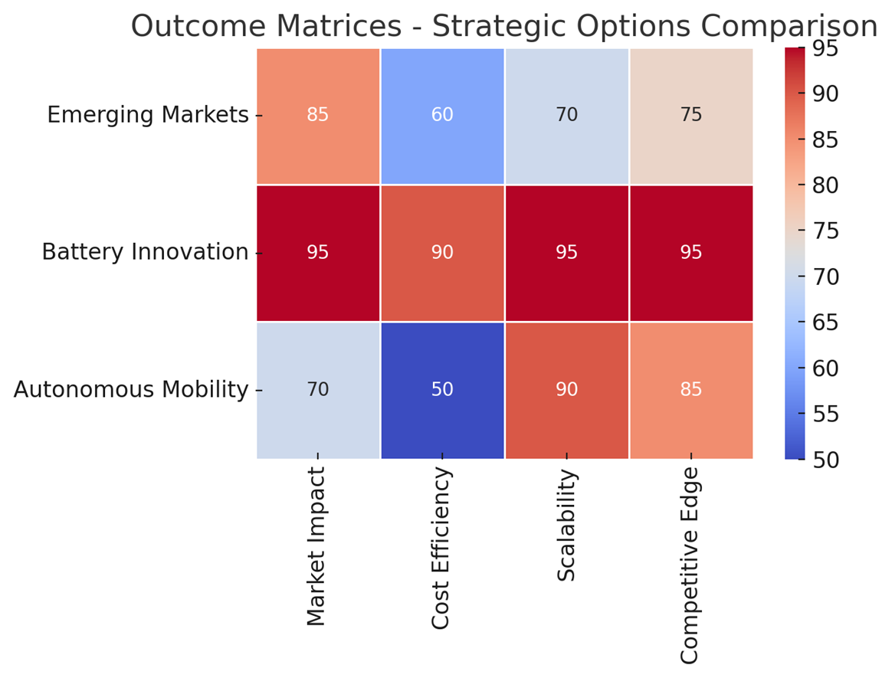
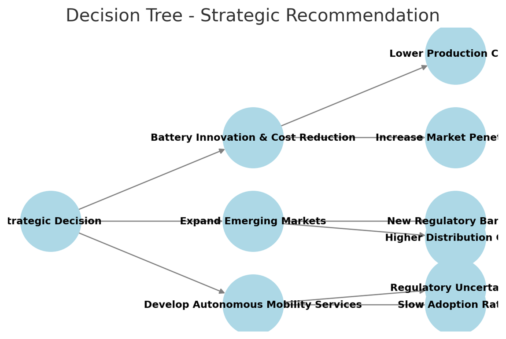

# ⚡ Strategic Analysis: Tesla Inc.
### Capstone Project - Business Strategy Specialization

**Institution:** University of Virginia Darden School of Business
**Author:** Gabriel Marín Huerta
**Focus:** Corporate Strategy, Competitive Analysis, Decision Making
**Date:** January 2025
[📥 Click here to read the Full Strategic Report (PDF)](Tesla_Report.pdf)
---

## 📑 Executive Summary
Tesla Inc. is at the forefront of the EV industry but faces critical challenges regarding supply chain constraints and intensifying competition. This strategic analysis evaluates three potential pathways for growth. After applying competitive frameworks (SWOT, Porter's 5 Forces) and quantitative scoring, the analysis recommends prioritizing **Battery Innovation and Cost Reduction** over immediate geographic expansion to maintain long-term competitive differentiation.

---

## 1. 🔍 Competitive Analysis
To understand Tesla's position, I applied industry-standard strategic frameworks to identify key opportunities and threats.

### SWOT Analysis Highlights
* **Strengths:** Advanced battery technology, proprietary charging network, and strong R&D capabilities.
* **Weaknesses:** Supply chain vulnerabilities and high dependence on raw material costs.
* **Opportunities:** Expansion into energy storage markets and global EV adoption.

### Porter's Five Forces
The analysis revealed high threats from **Industry Rivalry** (traditional automakers entering EV) and **Supplier Power** (lithium scarcity), necessitating a strategy that reduces dependency on external suppliers.

---

## 2. 🚦 The Strategic Dilemma
Tesla faces a critical trade-off identified in the *Strategic Issues Matrix*:

1.  **Expansion into Emerging Markets:** High complexity due to infrastructure and regulatory barriers in regions like India and Latin America.
2.  **Cost Reduction (Battery Tech):** High urgency due to volatility in lithium costs and the need for affordable EVs.

> **Key Insight:** "As battery costs determine EV affordability and market penetration, investing in cost-efficient battery solutions is critical to sustaining Tesla’s competitive edge."

---

## 3. 🎯 Evaluation & Recommendation
To determine the best strategic pathway, I evaluated three options against key success criteria: Market Impact, Cost Efficiency, Scalability, and Competitive Edge.

### Strategic Options Comparison (Outcome Matrix)
As shown in the analysis below, **Battery Innovation** achieved the highest score (**95/100**), outperforming expansion into emerging markets (**85/100**).

### The Final Decision
Based on this quantitative evaluation, the selected strategy is **Battery Innovation & Cost Reduction**.

**Why this strategy won?**
* **Score:** It maximized scores in *Scalability* and *Competitive Edge*, whereas Emerging Markets scored lower on *Cost Efficiency* due to infrastructure risks.
* **Differentiation:** Lower battery costs improve affordability for the entire product line.
* **Resilience:** It solves the urgent supply chain issue identified in the Strategic Issues Matrix.

### Implementation Plan (Next Steps)
1.  **Expand R&D** in solid-state and next-generation lithium-ion batteries.
2.  **Strengthen Partnerships** for secure raw material supply.
3.  **Scale Production** at Gigafactories to internalize battery manufacturing.

---

## 📊 Scenario Planning
To ensure robustness, I analyzed potential market shifts. The strategy remains viable even in moderate growth scenarios.

---
*Based on the Capstone Project for the "Business Strategy" Specialization by UVA Darden School of Business.*
